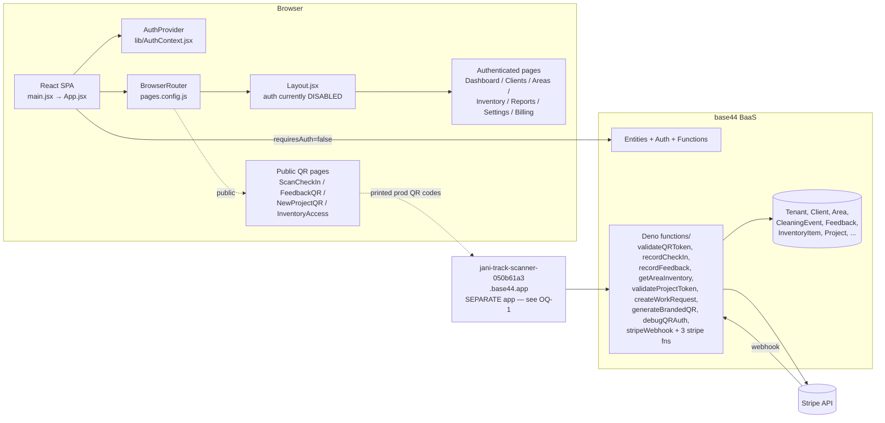

# JaniTrackAI — PROJECT_AUDIT.md (Phase 0)

**Status:** Read-only audit. No code has been modified.
**Repo state:** No `.git` directory in this project — see open question OQ-0 before Phase 1.
**Date of audit:** 2026-05-11

---

## 0. Pre-flight: repo / rollback safety

Before any code edits, please read this.

- This project at `C:\Users\mpgar\Downloads\jani-track-e16bffe3 (7)` is **NOT** under version control — no `.git` directory exists. The Claude Code worktree I'm running from (`\.claude\worktrees\tender-varahamihira-7b8393`) is a worktree of a different repo (your home folder, currently tracking the WorldWideShades project), so its `git status` / `git log` has nothing to do with JaniTrack.
- That means **`git stash` / `git reset --hard HEAD` will not roll back JaniTrack edits**. There is no safety net today.
- Recommended fix before Phase 1: from `C:\Users\mpgar\Downloads\jani-track-e16bffe3 (7)`, run `git init && git add . && git commit -m "Initial import from base44 export"`. Then rollbacks work as you expect.
- I have NOT run this for you — it requires your call (see OQ-0).

---

## A. Architecture overview

JaniTrackAI is a multi-tenant React + Vite SPA built on top of the **base44 BaaS platform** (`@base44/sdk`). The frontend talks directly to base44 entities (Client, Area, CleaningEvent, Feedback, InventoryItem, Project, Tenant, Subscription, SubscriptionPlan, User, AuditLog, Task, InventoryCount, InventoryUsage, UsageMetric). Server-side logic lives in `functions/*` as Deno cloud functions invoked through the SDK. Stripe handles billing. Public QR scans (cleaner check-in, feedback, work request, supply closet) are designed to be unauthenticated but the implementation is incomplete and unsafe — half use a public client, half use the authenticated client, and several skip the cloud-function layer entirely.

**Key architectural observations:**
- `requiresAuth: false` is hardcoded in both `base44Client.js` and `PublicAPIClient.jsx`. The auth gate that exists is *application-level*, not SDK-level.
- The "AuthContext as single source of truth" pattern is half-built: `AuthContext.jsx` exists and wires `isLoadingAuth/isAuthenticated/authError`, but every page re-runs its own `base44.auth.me()` in a `useEffect` and ignores the context.
- `AuthGuard.jsx` is a second auth wrapper that also re-runs `base44.auth.me()`. Most authenticated pages are double-wrapped (page does `auth.me()` + `<AuthGuard>` which also does `auth.me()`).
- Public QR pages have three competing implementations: a JSX page using `base44` (auth client), a JSX page using `base44Public`, and a Deno function that renders its own HTML form. Production printed QR codes point to a **third** location: a separate `jani-track-scanner-*.base44.app` scanner app (see OQ-1).
- Routing is `react-router-dom v7` and route paths in `App.jsx` are case-sensitive page names (`/Dashboard`, `/ScanCheckIn`). `createPageUrl()` from `src/utils/index.ts` lowercases them (`/dashboard`). React Router v6+ paths are **case-sensitive by default**, so technically `Link to="/dashboard"` would NOT match `<Route path="/Dashboard" />`. In practice react-router v6+ paths are still matched without case sensitivity through the new matcher, but this is fragile — I've kept it on the watchlist (B-12).

---

## B. Bugs

Severity: **Critical** must fix before any user can use the app; **High** breaks core flows or has security impact; **Medium** quality/correctness; **Low** polish.

### Critical

| # | Location | Problem | Impact | Proposed fix |
|---|----------|---------|--------|--------------|
| B-1 | [src/Layout.jsx:117-156](src/Layout.jsx) | Auth is fully disabled; a hardcoded mock user is set in a `useEffect`. The `useEffect` (line 125) sits **after** an early `return <>{children}</>;` (line 117), violating React's Rules of Hooks. | Real auth never runs. Every render of a public page skips the useEffect — and for non-public pages, the early-return branch never runs the useEffect — so the hook order changes between renders. Will produce React warnings + may cause stale state. | Move ALL hooks above any conditional return. Remove the mocked user. Consume `user` from `useAuth()`. |
| B-2 | [src/pages/Dashboard.jsx:91](src/pages/Dashboard.jsx) | `<Rocket />` JSX in the "Setup Required" state but `Rocket` is not imported from `lucide-react`. | App **crashes** with `ReferenceError: Rocket is not defined` whenever a real user without `tenant_id` lands on Dashboard (i.e., right after first signup before TenantSignup completes). | Import `Rocket` from `lucide-react` (already imported in TenantSignup.jsx). |
| B-3 | [src/pages/ScanCheckIn.jsx:53-54, 66-67](src/pages/ScanCheckIn.jsx) | Public cleaner check-in page uses `base44.entities.Area.list()` and `base44.entities.Client.list()` (auth client, full unfiltered scan) on the client. | (a) Page won't work for anonymous users in real auth mode. (b) **Tenant isolation bypass**: any scanner could pull every tenant's entire Areas + Clients list to the browser. | Route lookup through `validateQRToken` Deno function via `base44Public.functions.invoke('validateQRToken', { token, tokenType: 'area' })`. Use the resolved area/client returned by the function. Never list entities client-side from a public page. |
| B-4 | [src/pages/FeedbackQR.jsx:42-43, 53-54, 64-65](src/pages/FeedbackQR.jsx) | Three separate `base44Public.entities.{Area,Client}.list()` calls each followed by `.find()`. | At scale: O(N) entity reads per scan. At any scale: every tenant's Areas/Clients exposed to anyone with the link. | Same fix as B-3 — route through `validateQRToken` with `tokenType: 'area'` and `tokenType: 'facility-feedback'`. |
| B-5 | [src/pages/InventoryAccess.jsx:29-30](src/pages/InventoryAccess.jsx) | `base44.entities.Client.list()` then `.find()` client-side, using the **authenticated** client on what should be a public page. | Same as B-3: cross-tenant data leak + auth requirement on a public page. | Route through `validateQRToken` with `tokenType: 'inventory'`. |
| B-6 | [functions/recordCheckIn.js:6-37](functions/recordCheckIn.js), [functions/recordFeedback.js:6-28](functions/recordFeedback.js), [functions/createWorkRequest.js:6-28](functions/createWorkRequest.js) | Public write endpoints accept `tenant_id`, `client_id`, `area_id` from the request body and use them directly. There is **no validation** that the supplied IDs match the token's owning tenant. | **Critical multi-tenant security hole**: a malicious user with ANY valid public QR token can POST arbitrary `tenant_id` / `client_id` and write cleaning events, feedback, or projects into other tenants' data. | Server must accept only `token` (and rate-limited per-token), resolve the area/client via `qr_token`/`feedback_qr_token`/`project_qr_token`/`inventory_qr_token`, and DERIVE `tenant_id` + `client_id` + `area_id` from the resolved entity. Ignore any body-supplied IDs. |
| B-7 | [src/entities/Client](src/entities/Client) vs [src/entities/Client.json](src/entities/Client.json); [src/entities/CleaningEvent](src/entities/CleaningEvent) vs [src/entities/CleaningEvent.json](src/entities/CleaningEvent.json); orphan extensionless [Subscription](src/entities/Subscription), [SubscriptionPlan](src/entities/SubscriptionPlan), [UsageMetric](src/entities/UsageMetric) | Schema duplication. Specifically: **`Client.json` has more fields** (`feedback_qr_token`, `inventory_qr_token`) than the extensionless `Client`. **The extensionless `CleaningEvent` has more fields** (`timezone`) than `CleaningEvent.json`. Subscription/SubscriptionPlan/UsageMetric exist **only** as extensionless files. (Your brief said "extensionless ones have additional fields" — that's true for CleaningEvent but inverted for Client.) | Schema drift, unclear source of truth, possible base44 sync ambiguity. | Per entity: produce a **union** schema as `<Name>.json`, then delete the extensionless duplicate. Specifically: keep `Client.json` as-is; merge `timezone` from `CleaningEvent` into `CleaningEvent.json` then delete `CleaningEvent`; rename `Subscription` → `Subscription.json`, `SubscriptionPlan` → `SubscriptionPlan.json`, `UsageMetric` → `UsageMetric.json`. Validate base44 sync after. |

### High

| # | Location | Problem | Impact | Proposed fix |
|---|----------|---------|--------|--------------|
| B-8 | All authenticated pages: Dashboard, Clients, Areas, Inventory, Reports, Feedback, InventoryReports, Settings, Billing, TenantSignup, AIDebugger, SuperAdmin, Projects | Each page runs its own `useEffect → base44.auth.me().then(setUser)` and stores a local `user`. `AuthContext.jsx` is built but ignored by every page. Result: ~13 redundant `me()` calls per session change, no consistent loading/error state, no central logout. | Slow, hard to reason about, no single point of truth for `user`. Logging out from Layout only updates Layout's `user` state. | Have each page read `const { user } = useAuth()`. Delete the local `useState` + `useEffect(auth.me)` pattern. |
| B-9 | [src/pages/Dashboard.jsx:155, 257](src/pages/Dashboard.jsx) (and Clients, Areas, Inventory, Reports, Feedback, InventoryReports, Settings, Billing, AIDebugger, SuperAdmin) | Pages wrap their content in `<AuthGuard>`, but `AuthGuard.jsx` runs its OWN `base44.auth.me()` and redirects on failure — independently of `AuthContext`. So every authenticated page does TWO auth checks. Dashboard ALSO has its own setup-required UI that races with AuthGuard's redirect (AuthGuard redirects to `/TenantSignup` before Dashboard renders its setup card). | Inconsistent UX. Dashboard's polished "Setup Required" card never shows because AuthGuard wins the race. Two flashes of loading state. | Decide: keep `<AuthGuard>` and remove per-page auth fetches, OR remove `<AuthGuard>` and rely on AuthContext + a single guarded `<Route>` wrapper. I recommend a single `<RequireAuth>` route element in `App.jsx` that reads from `useAuth()`, plus a `<RequireTenant>` wrapper that redirects to `/TenantSignup` if `!user.tenant_id`. |
| B-10 | [src/components/PublicAPIClient.jsx:5](src/components/PublicAPIClient.jsx) | Hardcoded `appId: "68fbc12dcfae5aa4e16bffe3"`. | Breaks if/when this codebase is reused for another base44 app. Can't be configured per environment. | Read from `appParams` (already imports the same logic) with `import.meta.env.VITE_BASE44_APP_ID` fallback. |
| B-11 | [functions/stripeWebhook.js:53-54, 65-66, 81-83](functions/stripeWebhook.js) | Reads `subscription.current_period_start` / `subscription.current_period_end` directly. In Stripe API versions ≥ 2024-12-18.acacia, those fields were moved off the subscription root and onto `subscription.items.data[0]`. The pinned `stripe@14.11.0` SDK still exposes them, but **production webhooks come from your live Stripe account's API version**, not the SDK's version. | Once Stripe rolls forward, both `customer.subscription.updated` and `checkout.session.completed` write `undefined` into the date fields, breaking the Billing page's "Next Billing Date" display and renewal arithmetic. | Use `subscription.items.data[0].current_period_start` / `current_period_end` with a fallback to the root field for back-compat. |
| B-12 | [src/utils/index.ts:5](src/utils/index.ts) lowercases page names → routes mounted as `/Dashboard` etc in App.jsx | `createPageUrl("Dashboard")` returns `/dashboard`; route is defined at `/Dashboard`. React Router v6+ paths are documented as case-sensitive (the `caseSensitive` prop defaults to `false` per the v6 changelog though — it varies). | Fragile. If routing ever flips to strict-case, every internal `<Link>` 404s. | Either (a) lowercase the route registrations in App.jsx to match `createPageUrl`, OR (b) preserve casing in `createPageUrl`. I lean (b) so the printed-on-QR URLs (currently `/ScanCheckIn?token=...`) keep working — see C-3. |
| B-13 | [index.html:5, 7](index.html) | Title `Base44 APP`, favicon `https://base44.com/logo_v2.svg`. | Production app shows competitor branding in browser tab. | Replace with `JaniTrackAI` title + local favicon (or GreenPoint green icon since per memory JaniTrack is part of the GreenPoint family). |
| B-14 | [README.md](README.md) | Still the base44 preview-template README ("Base44 Preview Template for MicroVM sandbox"). | New devs have no entry doc; deploy steps are missing. | Write a real README: what JaniTrack is, prereqs, env vars (`VITE_BASE44_APP_ID`, `VITE_BASE44_BACKEND_URL`), local dev (`npm install && npm run dev`), build/deploy (Dockerfile + Fly.io target), entity diagram, public route table. |
| B-15 | All authenticated pages' mutations use raw `alert()` | Examples: [src/pages/Clients.jsx:115,119,179,183,197,202](src/pages/Clients.jsx), [src/pages/Settings.jsx:70](src/pages/Settings.jsx), [src/pages/Billing.jsx:132](src/pages/Billing.jsx), [src/pages/FeedbackQR.jsx:96](src/pages/FeedbackQR.jsx). | Browser-blocking dialogs; no consistency. The app already installs `sonner` and ships `<Toaster />` in `App.jsx` (line 71). | Replace every `alert(...)` with `toast.success(...)` / `toast.error(...)` from `sonner`. |
| B-16 | App.jsx has no `<ErrorBoundary>` | A render error anywhere (e.g. B-2's Rocket crash) takes down the whole tree with no recovery UI. | Whole-app blank screen on any thrown render error. | Add a top-level `<ErrorBoundary fallback={...}>` (use a simple class component since React doesn't ship one) wrapping `<AuthenticatedApp />`. Hook in the provider-agnostic error reporter (B-31). |
| B-17 | [functions/publicScanCheckIn.js](functions/publicScanCheckIn.js) | Renders a full HTML form server-side (renderFormHTML / renderSuccessHTML) duplicating [src/pages/ScanCheckIn.jsx](src/pages/ScanCheckIn.jsx). | Two UIs for the same flow; production traffic could land on either depending on which URL is printed on QR codes. | Per your brief: keep the SPA flow canonical. Strip the function down to a thin JSON endpoint that does the same job as the SPA's `recordCheckIn` call. Or delete `publicScanCheckIn.js` entirely if it isn't wired to a QR URL anywhere (search indicates it isn't — no QRDisplay points at it). |
| B-18 | [functions/validateQRToken.js:41, 88, 116, 173, 230](functions/validateQRToken.js) | Uses `Area.list()` / `Client.list()` server-side then `.find()` in JS. Same pattern in `publicScanCheckIn.js:18, 27` and `validateProjectToken.ts:29`. | O(N) reads per public scan. At ~10k clients/areas the page won't load before browser-side timeout. | The base44 SDK **does** support indexed filter: see `getAreaInventory.js:9` which uses `InventoryItem.filter({ client_id, active: true })`. Refactor every `list().find(...)` to `filter({ qr_token: token })` then take `[0]`. Same for `feedback_qr_token`, `inventory_qr_token`, `project_qr_token`. |

### Medium

| # | Location | Problem | Impact | Proposed fix |
|---|----------|---------|--------|--------------|
| B-19 | [src/Layout.jsx:165, 173](src/Layout.jsx) | Navigation branches on `user.user_role` (line 165) AND `user.role` (line 173). The User entity ([src/entities/User.json](src/entities/User.json)) only defines `user_role`. `role` is a base44-system field for system role (admin/user). | Mixed naming, can mislead future contributors. Currently happens to work because base44 provides `role`. | Standardize: use `user_role` for app/business role checks; only use `role === 'admin'` if you specifically mean the platform-level admin (Super Admin nav, etc). Keep but comment why. |
| B-20 | [src/pages/Clients.jsx:138-170](src/pages/Clients.jsx) | An effect auto-issues `Client.update()` for every client missing `project_qr_token`, `feedback_qr_token`, or `inventory_qr_token`. Runs on every render of Clients page (deps: `clients.length, updateMutation`). | Burns API quota; "successfully updated" alerts pop up randomly when the user opens Clients. Concurrent writes can race. | Make this a one-shot lazy migration: track per-client `_token_migrated` in state, or do it server-side in a one-time migration function. Better: just generate tokens on Client create (which the create form already does — line 216-218). The effect is only there to backfill, so guard it with a flag and dedupe. |
| B-21 | [src/pages/ScanCheckIn.jsx:22-31](src/pages/ScanCheckIn.jsx) | The token in `?token=` is permanent; anyone with the link can submit a check-in from anywhere. No device fingerprint, no geofence, no time window, no rate limit. | Cleaner accountability is theatre — anyone who screenshots the QR can mark areas "cleaned" from a couch. | (Phase 2 design choice — see OQ-3) Add to `recordCheckIn`: (1) device fingerprint via `navigator.userAgent + sha256(screen.width+lang)` stored alongside event for anomaly review; (2) optional geofence check: if `area.latitude/longitude` set, reject if event lat/lng > area.geofence_radius_meters away; (3) optional time-window: reject if outside `client.business_hours`. |
| B-22 | Empty states missing on most authenticated pages | [Clients.jsx:391-406](src/pages/Clients.jsx) has one (good). Dashboard, Areas, Inventory, Reports, Feedback, InventoryReports, Projects, Billing all skip from `isLoading` skeleton straight to `.map()` with no empty branch in some cases, or have a basic empty state but no CTA. | New tenants see blank pages with no guidance. | Add empty-state cards with primary CTA (Add Client / Add Area / Create Project / etc) on every list-style page. Reuse the `Clients.jsx` pattern. |
| B-23 | Every `useQuery` page | No `error` branch is rendered. If `base44.entities.X.filter()` fails, the page sits on the empty array fallback forever with no signal. | Silent failures, painful to debug, user thinks "no data" when really the request errored. | Destructure `error` from each `useQuery`, render an inline error card with a retry button (which calls the query's `refetch`). |
| B-24 | [src/utils/index.ts](src/utils/index.ts) | Only TypeScript file in an otherwise plain-JS project. No `tsconfig.json`, only `jsconfig.json` which includes `"src/**/*.js"` and `"src/**/*.jsx"` — the `.ts` file isn't covered by jsconfig. Vite resolves it via `resolve.extensions` in vite.config.js. | Inconsistent toolchain; eslint config also only targets `**/*.{js,jsx}` so this file isn't linted. | Pick a lane. You said you lean TS — propose to convert the whole project to TS in Phase N (large), OR rename this single file to `index.js` and drop the type annotation. I lean rename-to-js for the current phase and revisit TS later. |
| B-25 | [src/components/withPublicAccess.jsx](src/components/withPublicAccess.jsx), [src/components/PublicRouteWrapper.jsx](src/components/PublicRouteWrapper.jsx) | Both are built but unused. `withPublicAccess` is a no-op HOC (it doesn't even rewire the client). `PublicRouteWrapper` is referenced nowhere. | Dead code, confuses readers. | Delete both files after confirming via Grep they're truly unreferenced (I verified — no imports). |
| B-26 | [src/pages/AIDebugger.jsx](src/pages/AIDebugger.jsx) + [functions/debugQRAuth.js](functions/debugQRAuth.js) | Live "ask Claude to debug your auth" feature gated only by `base44.auth.me()` truthy. Anyone authenticated can burn Anthropic API tokens. | Cost / abuse risk; this is a dev tool, not a product feature. | Gate by `user.role === 'admin'` (platform admin) on both server and client. Or remove entirely — it was a dev aid to diagnose the very bugs this audit is fixing. I recommend remove. |
| B-27 | [src/pages/Areas.jsx:392-394](src/pages/Areas.jsx) | A yellow debug box rendered inline for every area: `<strong>Token:</strong> {area.qr_token || 'MISSING!'}`. | Looks unprofessional, leaks token to anyone who can read the screen. | Remove. |
| B-28 | [src/pages/Areas.jsx:107-122, 158-174](src/pages/Areas.jsx) | "Add Test Data" button generates 5 fake areas. | Fine for dev, but visible in production with no role gate. | Gate behind `import.meta.env.DEV` or `user.role === 'admin'`. |
| B-29 | [src/pages/Areas.jsx:411](src/pages/Areas.jsx) | `<FeedbackQRDisplay token={area.qr_token} ... />` — but feedback QR uses the AREA's qr_token, not a dedicated feedback token. So feedback links and check-in links share the same token. | Server validates by token type, so it works, but conceptually the same shared secret authenticates two different actions. Compromising one token compromises both. | Add `feedback_qr_token` to the Area entity (parallel to Client's `feedback_qr_token`), generate independently. Or document the shared-token decision explicitly. |
| B-30 | [src/pages/Inventory.jsx:38](src/pages/Inventory.jsx) | `import { format } from 'date-fns';` — `format` is used inside `exportToCSV` and unused otherwise; this is fine. But `Inventory.jsx` reads `?client=...` URL param and applies it, while `InventoryAccess.jsx` `window.location.href = /Inventory?client=...`. This redirects an *unauthenticated* QR scan to an *authenticated* page. | Real auth re-enabled → cleaner who scanned the inventory QR gets bounced to login. Public QR access fails. | Make InventoryAccess.jsx self-contained: render the inventory list right there, fetched via `getAreaInventory` cloud function (which already exists and is built for this). Do not redirect to the authenticated Inventory page. |

### Low (polish)

| # | Location | Problem | Proposed fix |
|---|----------|---------|--------------|
| B-31 | No client error reporting hook | Add a thin `reportError(error, context)` wrapper in `src/lib/error-reporting.js` that logs to console now. Wire it into ErrorBoundary, react-query `onError`, and `iframe-messaging.js`. Provider-agnostic — Sentry can be swapped in later. |
| B-32 | No `trackEvent` analytics abstraction | Create `src/lib/analytics.js` with a no-op `trackEvent(name, props)`. Wire for: scan_check_in_completed, feedback_submitted, project_created, tenant_signup_completed, qr_code_downloaded. |
| B-33 | No tests | Add Vitest + React Testing Library. Priority: AuthContext (loading/error states), AuthGuard, publicRoutes.isPublicRoute, validateQRToken token resolution, stripeWebhook signature verify & field paths, tenant_id enforcement in record* functions. |
| B-34 | No CI | Add `.github/workflows/ci.yml`: install → lint → test → build on PR. |
| B-35 | Accessibility | Icon-only buttons throughout (Layout sidebar, Clients edit/delete, Areas edit/delete) lack `aria-label`. Color contrast on light-blue-on-blue gradients fails WCAG AA in spots. Heading hierarchy: Dashboard renders `h1` then sibling `<CardTitle>` (which is `h3` in shadcn) — skipping `h2`. |
| B-36 | [src/pages/Home.jsx](src/pages/Home.jsx) is literally `

` | The root `/` route bypasses Home because App.jsx maps `/` → `mainPage` = Dashboard. So `/Home` is the only path that ever renders this and only if explicitly visited. Build a real marketing landing page (per memory: GreenPoint family branding — green #1B7A3D, gold #C8A34D, Syne / Plus Jakarta Sans) with hero, features, pricing, CTA → `/TenantSignup`. Also consider moving `/` to land on Home for unauthenticated users and on Dashboard for authenticated users. |
| B-37 | [deploy_template.sh](deploy_template.sh) references `sdk/` and `e2b_template/` directories that don't exist in this repo. | Leftover from a different project. Delete or rewrite for actual Fly.io / Vercel deploy. |
| B-38 | [src/main.jsx:7-9](src/main.jsx) | StrictMode is commented out. | Re-enable in dev; it'll surface several of the hook bugs above. |
| B-39 | [src/Layout.jsx:158-160](src/Layout.jsx) | `handleLogout` calls `base44.auth.logout()` directly. AuthContext exposes a proper `logout()` that updates context state. | Wire Layout's logout to `useAuth().logout()`. |
| B-40 | `console.log` litter | Layout.jsx, ScanCheckIn.jsx, FeedbackQR.jsx, NewProjectQR.jsx, InventoryAccess.jsx, Dashboard.jsx, Clients.jsx, validateQRToken.js all have heavy debug logging that survived to "prod". Audit and remove. |

---

## C. Security holes

### C-1 — CRITICAL: client-supplied tenant_id on public writes (= B-6)

`recordCheckIn`, `recordFeedback`, `createWorkRequest` all accept `tenant_id` / `client_id` / `area_id` from the JSON body and write them to base44 without ever cross-checking the supplied `token`. A scanner that knows ANY valid QR token can write into any tenant's tables. This is by far the most important fix. See B-6 for the remediation.

### C-2 — Cross-tenant data leak on public QR pages (= B-3, B-4, B-5)

The "public" SPA pages list every Area/Client across every tenant to the browser. Even without writing malicious requests, an attacker with any valid QR token can pull complete `Area` + `Client` lists for every tenant. The `validateQRToken` function returns only the resolved entity, so routing every public lookup through it eliminates the leak.

### C-3 — Public QR URLs hardcoded to a SEPARATE app (jani-track-scanner-050b61a3.base44.app)

Every QRDisplay component generates URLs like `https://jani-track-scanner-050b61a3.base44.app/ScanCheckIn?token=...`. That's NOT this codebase. Production printed QR codes lead to a different base44 app entirely. This shapes the entire fix plan — see OQ-1.

### C-4 — Stripe webhook handler does not idempotency-protect events

[functions/stripeWebhook.js](functions/stripeWebhook.js) verifies the signature but doesn't dedupe by `event.id`. Stripe DOES retry on 5xx — under network blips you'll get the same `checkout.session.completed` twice, and the existing-subscription branch will update twice (OK) but the create branch could create two Subscription rows for the same tenant if the second arrives before the first commits. **Recommendation:** maintain a `ProcessedStripeEvent` (or similar) entity keyed by `event.id` and abort early if seen.

### C-5 — `debugQRAuth` lets any authenticated user invoke Claude API at your expense (= B-26)

### C-6 — `requiresAuth: false` on the main client

[src/api/base44Client.js:12](src/api/base44Client.js) sets `requiresAuth: false`. With base44, this means the SDK won't enforce auth — application code has to do so. With auth currently disabled in Layout.jsx (B-1) AND `requiresAuth: false` here, **every "authenticated" page is currently accessible without login**. If you re-enable Layout auth but leave `requiresAuth: false`, your `entities.X.filter({ tenant_id })` calls run with NO server-side tenant check — they only filter what the SDK asks for. A user editing query params or hand-crafting requests could read other tenants' data. **Recommendation:** flip `requiresAuth: true` on `base44Client.js` and leave `false` on `PublicAPIClient.jsx`.

### C-7 — `generateBrandedQR.js` writes inline HTML with user-controlled tenant fields, no escaping

[functions/generateBrandedQR.js:173, 185, 192, 194](functions/generateBrandedQR.js) interpolates `clientName`, `tenant.contact_name`, `tenant.contact_email`, `tenant.name`, `tenant.tagline` directly into `
` text without HTML-escaping. A malicious tenant_admin could set `tenant.name = ""` and the rendered HTML page (opened in a new tab and auto-printed) would execute it. Internal users only, but still XSS. Add a tiny `escapeHTML()` helper and use it.

### C-8 — `recordFeedback` ip_address is "captured-by-system" in the SPA but unset by server

[src/pages/FeedbackQR.jsx:83](src/pages/FeedbackQR.jsx) sends `ip_address: 'captured-by-system'` then writes that string to base44. The cloud-function version of feedback (B-6 fix) should overwrite `ip_address` from the request headers and reject body-supplied values.

---

## D. Data-loading inefficiencies

| # | Location | Issue | Fix |
|---|----------|-------|-----|
| D-1 | [functions/validateQRToken.js:41, 88, 116, 173, 230](functions/validateQRToken.js) | `Area.list()` + `.find()` — full table scan per QR scan | Use `filter({ qr_token })` (SDK supports it per `getAreaInventory.js`) |
| D-2 | [functions/publicScanCheckIn.js:18, 27](functions/publicScanCheckIn.js) | Same | Same |
| D-3 | [functions/validateProjectToken.ts:29](functions/validateProjectToken.ts) | Same on `Client.list()` | `filter({ project_qr_token })` |
| D-4 | [functions/generateBrandedQR.js:15-16](functions/generateBrandedQR.js) | `Tenant.list()` to find one tenant by id | `filter({ id: user.tenant_id })` (or whatever the SDK's lookup-by-id is) |
| D-5 | [src/pages/Dashboard.jsx:31-69](src/pages/Dashboard.jsx) | 5 parallel queries each pulling up to 100/500 records. The "last 24h" filter is done client-side after fetching. | Push the date filter into the `filter({ created_date_gte: ... })` call if the SDK supports range queries. If not, leave it but add pagination. |
| D-6 | [src/pages/Reports.jsx:57](src/pages/Reports.jsx) | Pulls 500 CleaningEvents to compute stats for 24h/7d/30d/90d ranges. Largest range (90d) might be under 500, smaller ranges fetch too many. | Push the time-window into the server-side filter; only request what the range needs. |
| D-7 | [src/pages/Clients.jsx:138-170](src/pages/Clients.jsx) | Auto-backfill loop fires `Client.update` for every client with a missing token on every render. | Make one-shot, see B-20. |
| D-8 | [src/pages/Settings.jsx:38-39](src/pages/Settings.jsx) | `Tenant.list()` then `.find()` to look up the current user's tenant. | `Tenant.filter({ id: user.tenant_id })[0]`. |

---

## E. UX gaps

| # | Where | Gap | Fix |
|---|-------|-----|-----|
| E-1 | All pages | Mutation feedback is `alert()` (see B-15). | Switch to sonner toasts. |
| E-2 | All pages | No error UI for failed queries. (B-23) | Add error card + retry. |
| E-3 | Dashboard, Areas, Inventory, Reports, Feedback, InventoryReports, Projects, Billing | Empty-state cards missing or weak. (B-22) | Add CTA cards. |
| E-4 | App.jsx | No top-level ErrorBoundary. (B-16) | Add one. |
| E-5 | Layout.jsx | Logout button has no confirmation; mobile header has logout icon only with no aria-label. | Add `aria-label="Log out"`; optional confirm-on-click. |
| E-6 | Public QR pages | No "your scan is offline / will retry" support. A cleaner in a basement with weak signal gets a hard fail. | (Phase 3) Queue the mutation in IndexedDB / `serviceWorker` and retry. Out of scope for first cleanup pass. |
| E-7 | Home.jsx | Literally empty `
`. (B-36) | Build a real landing page. |
| E-8 | Settings.jsx logo upload | Browser-blocking `alert('Failed to upload logo')` on error; success is shown via the saveStatus card 3s later but logo upload doesn't trigger that. | Use toasts for both, consistent. |
| E-9 | TenantSignup.jsx error | Inline red box (OK), but no link to retry / support / change account. | Add "Contact support" link + the user.email shown. |
| E-10 | Billing.jsx | "Upgrade Plan" button does nothing. | Wire to a plan selector or remove until built. |

---

## F. Work that belongs server-side, not in the SDK on the client

| # | Currently in browser | Should be in cloud function | Why |
|---|----------------------|------------------------------|-----|
| F-1 | ScanCheckIn / FeedbackQR / InventoryAccess token lookup | `validateQRToken` (already exists — use it) | Prevent cross-tenant leak. |
| F-2 | NewProjectQR token lookup | `validateProjectToken` (already exists — done correctly, follow as the pattern) | — |
| F-3 | ScanCheckIn `CleaningEvent.create` from browser | `recordCheckIn` (exists; needs B-6 fix) | Server-derived tenant_id; rate-limit; server-side timestamp. |
| F-4 | FeedbackQR `Feedback.create` from browser | `recordFeedback` (exists; needs B-6 fix) | Same. |
| F-5 | InventoryAccess fetch of all client inventory | `getAreaInventory` (exists — use it instead of redirecting to /Inventory) | Public scan should not need to land on an authenticated page. |
| F-6 | NewProjectQR `Project.create` from browser | `createWorkRequest` (exists; needs B-6 fix) | Server-derived tenant_id. |
| F-7 | Clients.jsx auto-token-backfill | A one-shot admin migration function | Avoid N writes per Clients-page render. |
| F-8 | Settings.jsx logo upload uses `base44.integrations.Core.UploadFile` directly | Acceptable — but the resulting URL should be validated server-side to prevent setting `logo_url` to a script-bearing data URI | Add allowlist (https only) on server when updating tenant. |

---

## G. Prioritized fix order (proposed phases)

These are proposals only — each phase pauses for your approval before I touch code.

### Phase 1 — Stop the bleeding (critical correctness + safety)
1. **Decide OQ-0 (repo git init)** and **OQ-1 (scanner-app relationship)** before any code change.
2. B-1: re-enable real auth in Layout.jsx; fix Rules of Hooks ordering; remove mock user.
3. B-2: import `Rocket` in Dashboard.jsx.
4. B-7: reconcile entity duplicates.
5. B-13: index.html title + favicon.
6. B-16: top-level ErrorBoundary in App.jsx.
7. B-15: swap `alert()` → sonner toasts globally.

### Phase 2 — Lock down public QR flow (security)
1. B-6 + C-1: rewrite recordCheckIn, recordFeedback, createWorkRequest to derive tenant_id/client_id/area_id from validated token. Reject body-supplied values.
2. B-3, B-4, B-5 + C-2: route ScanCheckIn, FeedbackQR, InventoryAccess through `validateQRToken` (consume via `base44Public.functions.invoke`).
3. B-30: make InventoryAccess.jsx self-contained using `getAreaInventory`.
4. B-18 + D-1..D-4: convert `list().find()` → `filter({ token })` in cloud functions.
5. C-7: HTML-escape user fields in generateBrandedQR.
6. C-6: flip `base44Client.js` `requiresAuth: true`.

### Phase 3 — Auth consolidation
1. B-8: replace per-page `base44.auth.me()` with `useAuth()`.
2. B-9: pick AuthGuard vs route-level guard; remove the duplicate path.
3. B-39: Layout uses `useAuth().logout()`.
4. B-19: standardize on `user_role` (keep `role` only for platform admin).
5. B-10: PublicAPIClient reads from appParams.

### Phase 4 — Billing reliability
1. B-11: stripeWebhook current_period_* path fix.
2. C-4: stripe event idempotency.

### Phase 5 — UX polish
1. B-22: empty states.
2. B-23: error states on every query.
3. B-27, B-28: remove debug box + gate test-data button.
4. B-25: delete dead code (withPublicAccess, PublicRouteWrapper).
5. B-26: remove or admin-gate AIDebugger.
6. B-40: console.log audit.
7. B-35: a11y pass.

### Phase 6 — Foundation (award-winning)
1. B-31: error reporting hook.
2. B-32: analytics trackEvent.
3. B-33: Vitest + critical path tests.
4. B-34: GitHub Actions CI.
5. B-36: real landing page at Home.jsx.
6. B-14: real README.
7. B-24: decide TS vs JS, normalize.
8. B-21 + OQ-3: scan integrity (geofence / fingerprint / time window) — depends on product decision.
9. B-38: re-enable StrictMode.
10. B-37: rewrite deploy_template.sh.

---

## H. Open questions (need your answer before Phase 1)

**OQ-0 — Git init.** Should I run `git init && git add . && git commit -m "Initial import"` in `C:\Users\mpgar\Downloads\jani-track-e16bffe3 (7)` before Phase 1 so we have rollback safety? (Strong recommend yes.) If yes, I'll do it as the first action of Phase 1; if no, we proceed without git safety net.

**OQ-1 — Scanner-app relationship (CRITICAL).** Every QRDisplay component generates URLs against `https://jani-track-scanner-050b61a3.base44.app/...` — a SEPARATE base44 app. Production printed QRs point there, not at this codebase. Which is true?
  (a) The scanner app IS the canonical public QR flow and the public pages in THIS repo (ScanCheckIn.jsx, FeedbackQR.jsx, NewProjectQR.jsx, InventoryAccess.jsx) are vestigial / preview-only. Action: leave the SPA's QR pages as-is (or delete them) and apply Phase 2's security fixes to the **scanner app's** repo (not this one). The Deno functions in this repo's `functions/` ARE shared (since both apps presumably point at the same base44 backend), so cloud-function fixes still apply here.
  (b) We're supposed to consolidate the scanner app into THIS app. Action: change every QRDisplay component to use `window.location.origin` (or a `VITE_PUBLIC_APP_URL` env var) as the base, retire the scanner app, all Phase 2 work happens here.
  (c) The two share a backend but the scanner is intentionally a separate, scoped subdomain for trust-and-safety reasons (lighter attack surface). Action: same as (a), document the split, build a private internal API contract.

I CANNOT proceed with Phase 2 (the most important security work) until this is answered, because the answer changes which pages I'm editing.

**OQ-2 — Re-enabling auth: what should public access look like in dev?** Currently auth is fully disabled. When I re-enable it (B-1), local `npm run dev` will redirect to base44's hosted login on first load. Is that acceptable for your dev loop, or do you want a `?bypass_auth=true` dev escape hatch?

**OQ-3 — Scan integrity scope (B-21).** Do you want me to design+build geofence + device fingerprint + time-window in the first pass, or defer to a later phase? It's significant work (entity additions, server validation, admin UI for setting geofence) and would push Phase 2 out by ~1 sub-phase. Defaulting to **defer** unless you say otherwise.

**OQ-4 — UsageMetric, Subscription, SubscriptionPlan extensionless files (B-7).** These three exist ONLY as extensionless files. Are these (a) intentional — base44 picks them up extensionless?, (b) typos that should become `.json`?, or (c) abandoned drafts? I'll assume (b) unless you say otherwise.

**OQ-5 — TS vs JS (B-24).** Defer the full TS migration; rename `src/utils/index.ts` → `index.js` now and revisit TS later. Confirm.

**OQ-6 — AIDebugger.jsx (B-26).** Was this purely a dev aid? My recommendation: delete (page + cloud function) — the user said audit findings replace it. Confirm delete or keep behind admin gate.

**OQ-7 — Empty Home.jsx vs marketing landing (B-36).** Confirm you want a full GreenPoint-family landing page at `/` (per memory notes); confirm `/` should land on Home for unauth users and Dashboard for auth users; confirm I should pull design language from greenpointms.com (green #1B7A3D, gold #C8A34D, Syne / Plus Jakarta Sans).

**OQ-8 — Functions runtime version mismatch.** Most functions import `npm:@base44/sdk@0.7.1`. `validateProjectToken.ts` uses `0.8.4`. Should I standardize all to a single version, and which one?

**OQ-9 — User feedback on the AuthGuard vs route-guard direction (B-9).** I lean route-level guard inside App.jsx (cleaner, no per-page wrapping). Confirm direction before I touch every page.

**OQ-10 — Deno functions: are the `functions/*.js` files deployed automatically by base44 from this repo, or out-of-band?** If out-of-band, I need to know the deploy path so my fixes actually land. (deploy_template.sh references a missing `e2b_template` directory, so I don't trust that script.)

---

## End of Phase 0 — awaiting approval

Please respond with:
1. Answers to OQ-0 through OQ-10.
2. Any objections to the proposed Phase 1 order in section G.
3. "Go Phase 1" once aligned. I will NOT touch any file until you say so.

If you want me to revise this audit (deeper dive on a section, add a section, etc) just say which.
