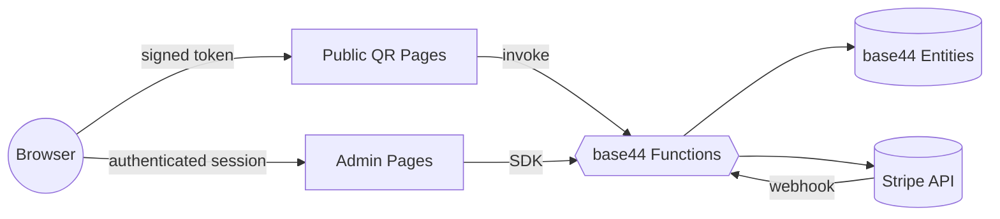

# JaniTrackAI

> QR-based cleaning quality verification, inventory tracking, and feedback for janitorial operations.
> Part of the GreenPoint family of brands.

## What it is

JaniTrackAI is a multi-tenant SaaS for janitorial operators. The product is built around printed QR codes that live on walls:

- **Cleaners** scan an area QR to log a check-in with photo and GPS.
- **Visitors / clients** scan a feedback QR to leave a 1–5 star rating + comment.
- **Supply closets** have an inventory QR that pulls up live par/reorder data.
- **Anyone** can scan a project QR to file a work request.
- **Operators** see live activity, compliance, and trouble areas on the dashboard.

Everything is scoped to a tenant. Public QR scans never see or write cross-tenant data — see [Architecture → Public flow](#public-flow-security) below.

## Stack

| Layer            | Tech                                                |
| ---------------- | --------------------------------------------------- |
| Frontend         | Vite + React 18, react-router-dom 7, Tailwind, shadcn/ui |
| State            | @tanstack/react-query                               |
| Backend (BaaS)   | [base44](https://base44.com) entities + auth + functions |
| Cloud functions  | Deno (npm:@base44/sdk), invoked via `base44.functions.invoke` |
| Billing          | Stripe (Checkout + Customer Portal + webhooks)      |
| Hosting          | Vercel (static SPA build)                            |
| Errors / analytics | Provider-agnostic stubs (`src/lib/error-reporting.js`, `src/lib/analytics.js`) |

## Repo layout

```
.
├── functions/                  # Deno cloud functions (deployed via base44)
│   ├── validateQRToken.js      # Resolve a public QR token → safe minimal payload
│   ├── validateProjectToken.ts # Same, for project-submission QR
│   ├── recordCheckIn.js        # Public cleaning check-in (tenant derived from token)
│   ├── recordFeedback.js       # Public area or facility feedback
│   ├── createWorkRequest.js    # Public project submission
│   ├── getAreaInventory.js     # Public inventory read for a client
│   ├── generateBrandedQR.js    # Server-side branded HTML for printable QR pages
│   ├── createCheckoutSession.js
│   ├── createCustomerPortal.js
│   ├── cancelSubscription.js
│   └── stripeWebhook.js        # Stripe → Subscription updates, with idempotency
├── public/favicon.svg
├── src/
│   ├── App.jsx                 # Router + ErrorBoundary + AuthProvider
│   ├── Layout.jsx              # Authenticated app shell (sidebar + topbar)
│   ├── main.jsx
│   ├── api/                    # Base44 SDK clients
│   ├── components/
│   │   ├── RouteGuards.jsx     # RequireAuth + RequireTenant
│   │   ├── ErrorBoundary.jsx
│   │   ├── EmptyState.jsx
│   │   ├── QueryErrorState.jsx
│   │   ├── PublicAPIClient.jsx # Anonymous client (requiresAuth: false)
│   │   └── …
│   ├── entities/               # JSON schemas (synced to base44)
│   ├── lib/
│   │   ├── AuthContext.jsx     # Single source of truth for the current user
│   │   ├── analytics.js
│   │   ├── error-reporting.js
│   │   ├── qr-urls.js          # Build printed QR URLs from VITE_PUBLIC_APP_URL or window.origin
│   │   ├── toast.js
│   │   └── …
│   ├── pages/                  # Route-level components
│   │   ├── Home.jsx            # Marketing landing page (/ for unauth, redirects auth users to /Dashboard)
│   │   ├── Dashboard.jsx, Clients.jsx, Areas.jsx, …
│   │   └── ScanCheckIn.jsx, FeedbackQR.jsx, NewProjectQR.jsx, InventoryAccess.jsx  # Public QR flows
│   └── utils/index.js
├── vercel.json                 # SPA rewrites + asset cache headers
├── vite.config.js
└── package.json
```

## Local development

### Prerequisites

- Node.js 22.x (matches the `Dockerfile`'s base image)
- A base44 app id

### Setup

```bash
git clone <repo-url>
cd jani-track-e16bffe3
cp .env.example .env.local
# Fill in VITE_BASE44_APP_ID at minimum
npm install
npm run dev
```

The app boots on `http://localhost:5173`.

### Useful scripts

| Command         | What it does                                        |
| --------------- | --------------------------------------------------- |
| `npm run dev`   | Vite dev server with HMR                            |
| `npm run build` | Production build → `dist/`                          |
| `npm run preview` | Serve the production build locally               |
| `npm run lint`  | ESLint over `src/`                                  |

## Routes

| Path                | Public? | Notes                                                     |
| ------------------- | ------- | --------------------------------------------------------- |
| `/`                 | yes     | Marketing landing page (auto-redirects to `/Dashboard` if logged in) |
| `/Home`             | yes     | Same as `/`                                               |
| `/ScanCheckIn`      | yes     | Cleaner QR — `?token=<area_qr_token>`                     |
| `/FeedbackQR`       | yes     | `?token=<area_qr_token>` or `?facilityToken=<client_feedback_qr_token>` |
| `/NewProjectQR`     | yes     | `?token=<client_project_qr_token>`                        |
| `/InventoryAccess`  | yes     | `?token=<client_inventory_qr_token>`                      |
| `/TenantSignup`     | auth    | Onboarding (auth-gated, tolerates missing `tenant_id`)    |
| `/Dashboard`        | auth + tenant | Default landing for authenticated users             |
| `/Clients`          | auth + tenant |                                                     |
| `/Areas`            | auth + tenant |                                                     |
| `/Feedback`         | auth + tenant |                                                     |
| `/Inventory`        | auth + tenant |                                                     |
| `/InventoryReports` | auth + tenant |                                                     |
| `/Projects`         | auth + tenant |                                                     |
| `/Reports`          | auth + tenant |                                                     |
| `/Settings`         | auth + tenant |                                                     |
| `/Billing`          | auth + tenant | tenant_owner-only nav entry                         |
| `/SuperAdmin`       | auth + admin role | Platform admin only                             |

Route paths are case-preserved — `createPageUrl()` returns `/Dashboard`, not `/dashboard`. This keeps printed QR URLs stable.

## Public flow (security)

Public QR scans never query the SDK directly. The flow is:

1. The SPA reads `?token=…` from the URL.
2. It calls `validateQRToken` (or `validateProjectToken`) with the token + a token type.
3. The function performs an **indexed** `filter({ field: token })` server-side and returns ONLY the minimum needed for the page (e.g. area name, client name) — never a full entity list.
4. For writes (`recordCheckIn`, `recordFeedback`, `createWorkRequest`), the server **derives** `tenant_id` / `client_id` / `area_id` from the validated token. Any IDs in the request body are ignored.

This closes two classes of bugs that existed in the original export:

- **Cross-tenant data leak**: public pages used to call `Entity.list().find(…)` which exposed every tenant's records to anyone with a QR link.
- **Cross-tenant write**: public write endpoints used to trust `tenant_id` from the request body.

## Architecture diagram



## Deployment

### Vercel

This repo is set up to deploy as a Vite SPA on Vercel.

1. Push the repo to GitHub.
2. In Vercel, "Add new project" → pick the repo.
3. Framework preset is auto-detected as **Vite**.
4. Set the env vars from `.env.example` in the Vercel project settings.
   - Minimum: `VITE_BASE44_APP_ID`.
   - Optional: `VITE_PUBLIC_APP_URL` if your printed QRs should resolve to a different host than your Vercel deployment.
5. Deploy. Vercel builds with `npm run build` and serves `dist/`.

`vercel.json` is included and:
- Rewrites every request to `/index.html` so direct navigation to `/ScanCheckIn?token=…` works.
- Sets a 1-year `Cache-Control` on `/assets/*` (Vite emits hashed filenames).

### Cloud functions

The Deno functions in `functions/` are deployed via base44's function tooling — they are NOT bundled into the Vercel build. Their environment variables (`STRIPE_SECRET_KEY`, `STRIPE_WEBHOOK_SECRET`, etc.) live in the base44 dashboard.

### Stripe webhook

Point Stripe's webhook at:

```
https://<your-base44-app>.base44.app/functions/stripeWebhook
```

The handler verifies the signature, supports both legacy and current Stripe API versions (subscription-level vs item-level `current_period_*`), and deduplicates by `event.id` if the `ProcessedStripeEvent` entity exists.

## Conventions

- **Toasts over `alert()`** — use `import { toast } from "@/lib/toast"`. Mounted at app root via `<Toaster />`.
- **Error reporting** — wrap risky paths with `import { reportError } from "@/lib/error-reporting"`. Swap the body of `reportError` to wire Sentry / LogRocket / etc.
- **Analytics** — `import { trackEvent, EVENTS } from "@/lib/analytics"`. No-op by default; swap the body for your provider.
- **Empty states** — every list page renders `<EmptyState />` from `@/components/EmptyState` when there's nothing to show.
- **Error states** — every `useQuery` page renders `<QueryErrorState />` from `@/components/QueryErrorState` when the fetch fails. Include a retry button.
- **Auth** — pages read `const { user } = useAuth()` from `@/lib/AuthContext`. Don't call `base44.auth.me()` from pages.
- **Public clients** — public QR pages import `base44Public` from `@/components/PublicAPIClient`. Authenticated pages import `base44` from `@/api/base44Client`.

## License

Private / proprietary. © GreenPoint Maintenance Services Corp.
